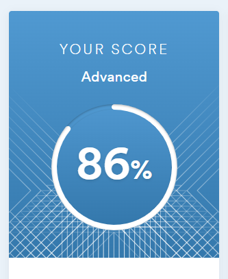

# Evgeniia Korolova

## Junior Frontend Developer

*******

### Contact information:

__Phone:__ +38 095 1726111

__E-mail:__ jkod@ukr.net

__Telegram:__ @EvgeniiaOdessa

[Linkedin](https://www.linkedin.com/in/evgeniia-korolova-9923aa274?lipi=urn%3Ali%3Apage%3Ad_flagship3_profile_view_base_contact_details%3BwP3GvSo7SzugdrNKSJnwzA%3D%3D)

______

### About me

I decided to change my professional field and become a front-end developer in January 2023. Since then, I've joined SheCodes community and their coding workshops. Coding captured my attantion from the first lessons. During my learning at SheCodes, I gained skills in Visual Studio Code, CodeSandbox, API, Bootstrap, Git, GitHub, Netlify. 
I joined the Rolling Scopes School in June 26 2023 to gain more fundamental knowlege and new skills.

___
### Skills and Proficiency:

* HTML5, CSS3, Bootstrap
* JavaScript Basics
* React Basics
* Git, GitHub
* VS Code
* Figma

______

### My projects:

__React Weather Application__

[Netlify](https://github.com/evgeniia-korolova/react-weather-app)

_May 2023_

This project was built using React, Bootstrap, Fontawesome and RESTful APIs.

__Website with the CV__

[Netlify](https://fanciful-frangollo-dcc140.netlify.app)

_April 2023_

This website was built using only HTML and CSS. It has multiple pages, fully responsive. To build this project Bootstrap and Fontawesome were also used.

__Weather Application built with JavaScript__

[Netlify](https://unrivaled-sawine-4047c2.netlify.app/)

_April 2023_

This web application was built with HTML, CSS, JavaScript and RESTful APIs. The application shows you the current forecast at the requested location, and also the forecast for the next 5 days.

___

### Languages :

* Russian - Native
* Ukrainian - Intermediate
* English - C1-C2

___

### Education :
* __Odessa National Economic University__

    Acoounting and Audit

_September 2009 - June 2014_

* __SheCodes__

    Front-End Developer

_January 2023 - June 2023_

* __Rolling Scopes School__

    RS School Course «JavaScript/Front-end. Stage 0» 

_in progress_